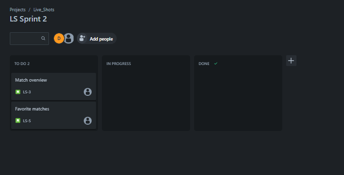

# Football Matches App (LiveShots)

## Project Overview

LiveShots is a football app designed to provide users with the ability to view football matches and standings. Users can register and log in to their accounts, mark matches as favorites, and filter matches based on date. Additionally, users can click on specific matches to access detailed information.

## Functionalities

1. **User Registration and Login:**
   - Users can create an account with their personal information.
   - Registered users can log in with their unique credentials.

2. **Match Overview:**
   - The app displays a list of all matches.
   - Matches are organized by competition.
   - Users can filter matches based on date.

3. **Favorite Matches:**
   - Users can mark matches as favorites.
   - Favorite matches are linked to a user.

4. **Match Details:**
   - Users can click on a match to view more details, such as line-ups, goal scorers, and other relevant information.

5. **Search and Filter**
   - Offer advanced search capabilities, allowing users to find matches, and filter a match on competitions and dates.

6. **Favorite Teams and Players Tracking**
   - Enable users to follow specific teams and players.
   
7. **Live Match Updates**
   - Real-time updates on ongoing and upcoming matches, including scores, and statistics.

8. **Personalized Notifications**
   - Push notifications for match start times, scores, and favorite teams and players.

## User Stories

1. **User Registration and Login (4hours):** 
   - As a user, I want to create an account to access personalized features so that I always be able to login with my account.
   - As a user, I want to log in to my account to access my personal data so that I can favorite a match.

2. **Match Overview: (12hours)**
   - As a user, I want to see a list of matches so that I have an overview of available matches.
   - As a user, I want to filter matches by competition and date so that I can find specific matches.

3. **Favorite Matches:(4hours)**
   - As a user, I want to mark a match as a favorite so that I be able to follow my preferred matches.
   - As a user, I want to view my list of favorite matches so that I be able to easily see my preferred matches. 

4. **Match Details:(10hours)**
   - As a user, I want to click on a match so that I be able to see more details of the match.

## Definition of Done

Additional Information:

A user story is considered 'done' if:
- The code is written, and tested.
- Acceptance criteria of the user story are fulfilled.
- Manual testing, if applicable, has been performed.
- Code has been integrated into the main branch.

## Planning

### Sprint 1 (Week 1):

1. **User Registration and Login - 4 hours**
2. **Match Overview - 12hours**

### Sprint 2 (Week 2):

3. **Favorite Matches - 4 hours**
4. **Match Details - 10 hours**

### Sprint 3 (Week 3):

5. **Finetuning and Testing - 4hours**
6. **Documentation and Finalization - 6 hours**

## Progress Monitoring

### Sprint 1 (Week 1):
- **Day 1 (7 hours):** Worked on the user login but didn't finish; encountered an issue with `api/users.js` not returning data to `index.js`.
- **Day 2 (5 hours):** The issue resolved and got the user login working.
- **Day 3 (4 hours):** Added sign-up functionality; it's now possible to log in with an account and log out.

      User registration and login took longer than planned. Therefore, I have postponed the user story "match overview" to Sprint 2.

### Sprint 2 (Week 2):
- **Day 1 (5 hours):** Started updating `api/matches` to pass ordered matches to `pages/matches.js`.
- **Day 2 (5 hours):** Continued updating the structure of the match overview to work with the updated `api/matches.js` GET method. And it's working now.
- **Day 3 ():**

### Sprint 3 (Week 3):
- **Day 1 ():**
- **Day 2 ():**

