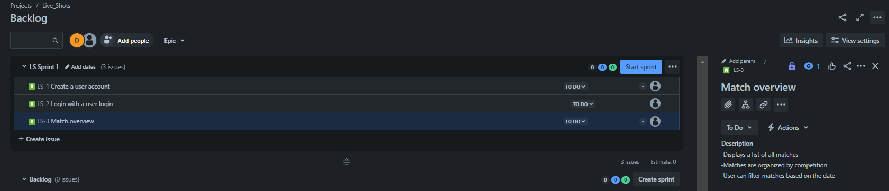
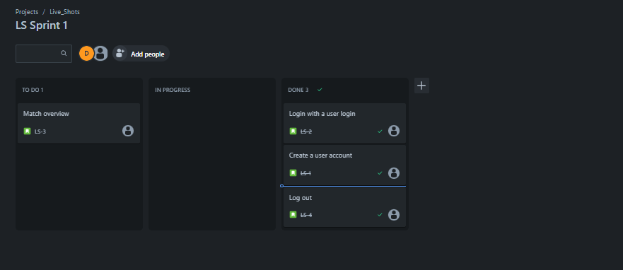

# Football Matches App (LiveShots)

## Project Overview

LiveShots is a football app designed to provide users with the ability to view football matches and standings. Users can register and log in to their accounts, mark matches as favorites, and filter matches based on date. Additionally, users can click on specific matches to access detailed information.

## Functionalities

Alle functionaliteit uit de briefing halen

1. **User Registration and Login:**
   - Users can create an account with their personal information.
   - Registered users can log in with their unique credentials.

2. **Match Overview:**
   - The app displays a list of all matches.
   - Matches are organized by competition.
   - Users can filter matches based on date.

3. **Favorite Matches:**
   - Users can mark matches as favorites.
   - Favorite matches are linked to a user.

4. **Match Details:**
   - Users can click on a match to view more details, such as line-ups, goal scorers, and other relevant information.

## User Stories

Waarom, uren meer criteria

1. **User Registration and Login:**
   - As a user, I want to create an account to access personalized features.
   - As a user, I want to log in to my account to access my personal data.

2. **Match Overview:**
   - As a user, I want to see a list of all matches to have an overview of available matches.
   - As a user, I want to filter matches by competition and date to find specific matches.

3. **Favorite Matches:**
   - As a user, I want to mark a match as a favorite to follow my preferred matches.
   - As a user, I want to view my list of favorite matches for quick access.

4. **Match Details:**
   - As a user, I want to click on a match to see more details for a comprehensive view of the match.

## Definition of Done

Meer info

A user story is considered 'done' if:
- The code is written and tested.
- Acceptance criteria are fulfilled of the user storie.

## Planning

### Sprint 1 (Week 1):

1. **User Registration and Login - 4 hours**
2. **Match Overview - 12hours**

### Sprint 2 (Week 2):

3. **Favorite Matches - 4 hours**
4. **Match Details - 12 hours**

### Sprint 3 (Week 3):

5. **Finetuning and Testing - 2hours**
6. **Documentation and Finalization - 6 hours**

## Voortgangsbewaking

Waarom niet alle functionaliteiten
Alle user stories op board

